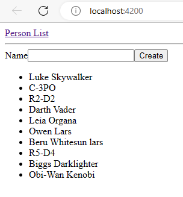
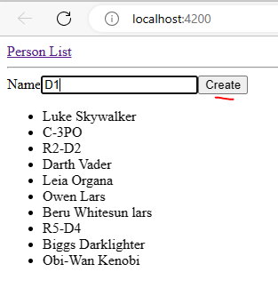
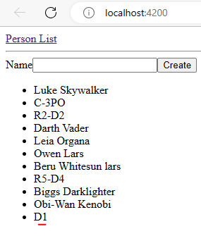
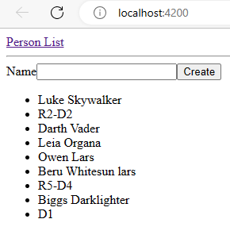

### Angular HTTP Request, Edit and Remove Example

Pic1_homepage_after_request_loaded.PNG  

Pic2A_Test_Add_PersonName.PNG

Pic2B_Test_Add_PersonName.PNG - Person name is added when button 'Create' is clicked.  

Pic2C_Test_Remove_PersonName.PNG - Person name is removed when name is clicked.
